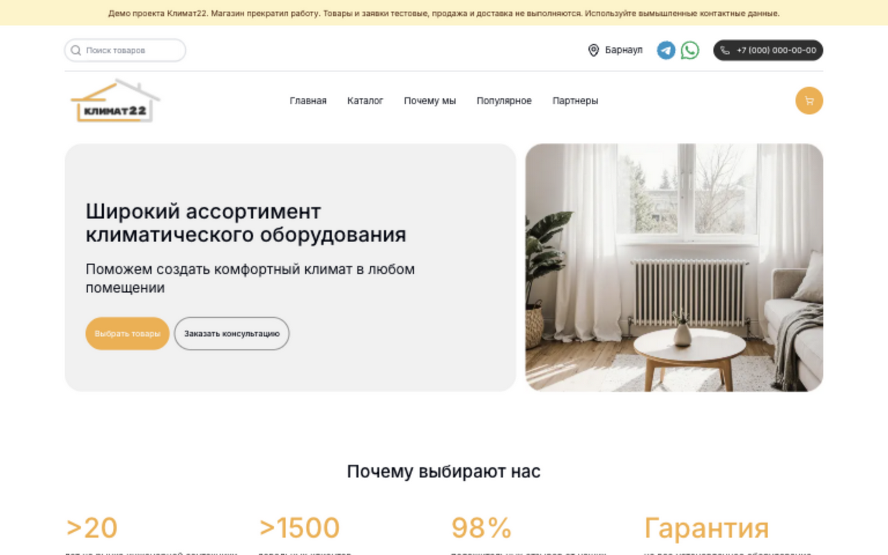
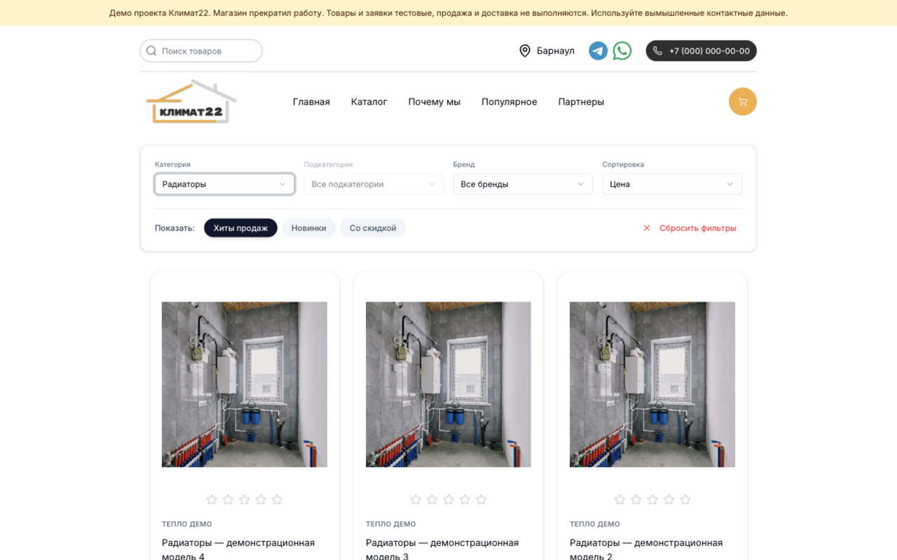
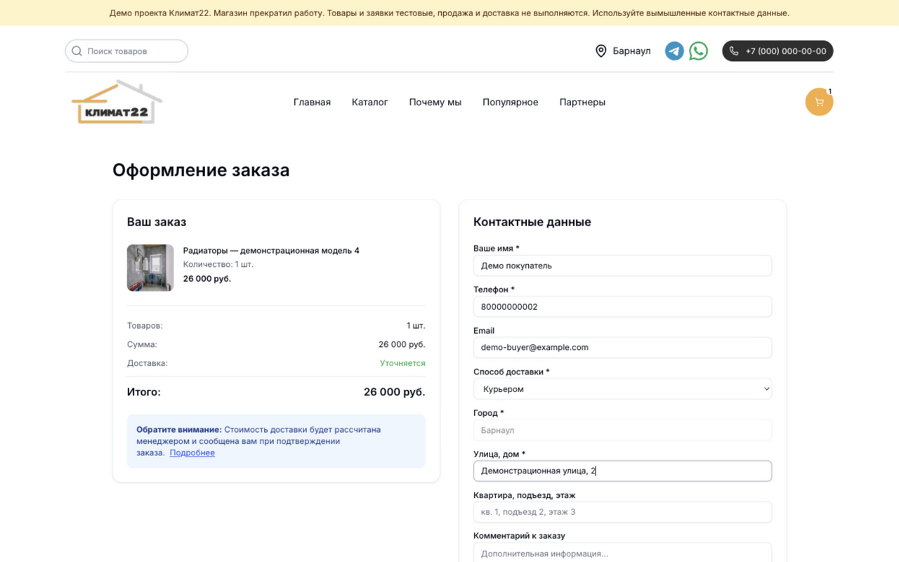
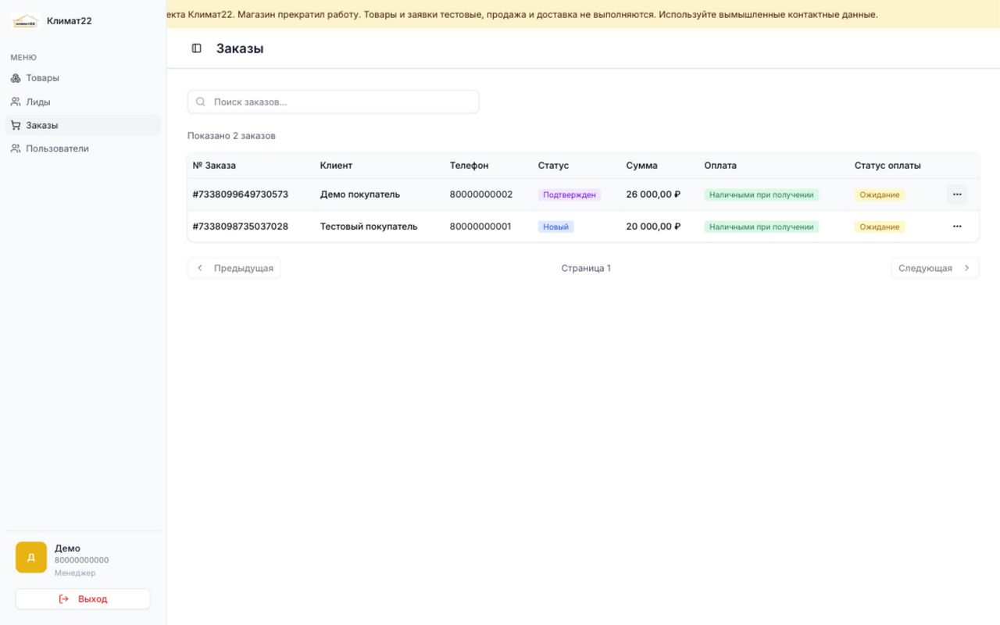
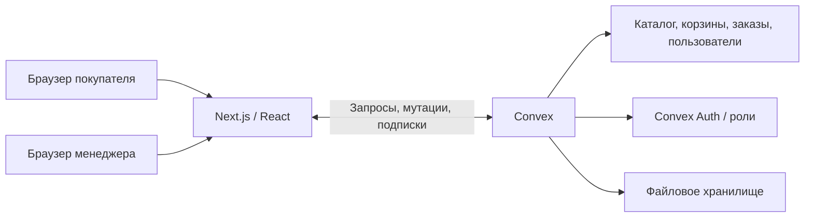

# Климат22 — интернет-магазин отопительного оборудования

<a href="https://githubfoxy.github.io/Klimat22/"></a>

<table>
<tr>
<td width="33%"><a href="assets/demo/catalog.png"></a></td>
<td width="33%"><a href="assets/demo/checkout.png"></a></td>
<td width="33%"><a href="assets/demo/orders.png"></a></td>
</tr>
</table>

[Все скриншоты и видео](https://githubfoxy.github.io/Klimat22/) · [Кабинет менеджера](assets/demo/manager.png) · [Карточка заказа](assets/demo/order-details.png)

Коммерческий проект для магазина отопительного оборудования в Барнауле. Покупатели выбирают товары и оформляют заявки; менеджеры управляют каталогом, заказами и обращениями.

Я был единственным разработчиком: согласовывал требования с заказчиком, привлёк дизайнера и разработал frontend и backend. Работа по договору: **сентябрь 2025 — март 2026**.

Для портфолио запущено демо с тестовыми товарами, заявками и аккаунтом менеджера.

## Демо и видео

- [Посмотреть видео — 1 минута 59 секунд, 756 КБ](https://githubfoxy.github.io/Klimat22/): витрина → каталог и фильтры → оформление заявки → кабинет менеджера → подтверждение заказа.

В демо используются вымышленные данные. Продажа, оплата и доставка не выполняются. Для проверки оформления заявки используйте вымышленные имя, телефон и адрес.

## Что разработал

- Каталог с категориями, брендами, поиском, фильтрами и вариантами товаров.
- Гостевую корзину, оформление заявок и страницу созданного заказа.
- Форму обращения за консультацией.
- Кабинет менеджеров: товары, заказы, обращения и пользователи; изменение статусов заказов.
- Схему данных и серверные функции Convex.
- Разграничение доступа по ролям, серверную валидацию и проверку принадлежности корзины и заказов.
- Снимки названий и цен товаров в заказе; защиту от повторного создания заказа из одной корзины.
- Миграцию схемы и данных через экспорт Convex, преобразование скриптами и импорт.
- Развёртывание frontend и backend на двух VPS через PM2 в коммерческом проекте.

## Стек

TypeScript, React, Next.js App Router, Convex, Tailwind CSS, Radix UI, TanStack Table, pnpm, Biome.

Демо размещено на Linux через Docker, systemd и Tailscale Serve.

## Архитектура



- `app/` — витрина, каталог, оформление заявки, страницы заказов и кабинет менеджера.
- `components/` — компоненты интерфейса.
- `convex/` — схема, запросы, мутации, авторизация и миграции.
- `backend/` — Docker Compose для self-hosted Convex и systemd-служба демо.
- `convex/demo.ts` — внутренние функции заполнения новой демо-базы; доступны через административный ключ. Запуск требует `DEMO_MODE=true` и пустой базы.

## Запуск с нуля

Нужны Node.js 22+, pnpm **10.32.1** и работающий Docker с Docker Compose. Установка, проверка TypeScript, сборка и запуск демо проверены на Linux. Convex Auth для self-hosted backend настраивается по [официальной инструкции](https://labs.convex.dev/auth/setup/manual).

### 1. Зависимости и отдельный backend

```bash
git clone https://github.com/GitHubFoxy/Klimat22.git
cd Klimat22
pnpm install --frozen-lockfile
cp .env.example .env.local
```

В `.env.local` установите `NEXT_PUBLIC_DEMO_MODE=true`. Начальные адреса в примере предназначены для локального запуска.

```bash
docker compose --env-file .env.local -p klimat22-demo \
  -f backend/docker-compose.yml.convex up -d backend
```

Получите ключ и сохраните его в переменную `CONVEX_SELF_HOSTED_ADMIN_KEY` файла `.env.local`:

```bash
docker compose --env-file .env.local -p klimat22-demo \
  -f backend/docker-compose.yml.convex exec backend ./generate_admin_key.sh
```

Административный ключ и JWT-ключи хранятся в окружении и не публикуются. Docker сохраняет данные в отдельном volume `klimat22-demo_data`.

### 2. Авторизация, схема и тестовые данные

```bash
node scripts/configure-demo-auth.mjs
pnpm exec convex dev --once
pnpm exec convex run demo:setup '{"password":"Klimat22-Demo-2026"}'
```

Функция создаёт 12 товаров в трёх категориях, один тестовый бренд и аккаунт менеджера `80000000000`. Повторное заполнение непустой базы отклоняется.

### 3. Frontend

```bash
pnpm typecheck
node scripts/check-demo.mjs
pnpm build
pnpm start
```

Откройте `http://localhost:3000`. Для разработки frontend используйте `pnpm dev:frontend`.

### 4. Демо через Tailscale на Omarchy

Текущий каталог демо: `~/projects/klimat22-demo`. В `.env.local` CLI использует локальный backend `http://127.0.0.1:3290`, а браузер — `NEXT_PUBLIC_CONVEX_URL=https://omarchy.tail089ef.ts.net:9444` и `NEXT_PUBLIC_CONVEX_SITE_URL=https://omarchy.tail089ef.ts.net:9445`. После `convex dev --once` восстановите эти два публичных адреса: CLI записывает локальные значения в `.env.local`.

Для Compose в `.env` заданы:

```dotenv
PORT=3290
SITE_PROXY_PORT=3291
CONVEX_CLOUD_ORIGIN=https://omarchy.tail089ef.ts.net:9444
CONVEX_SITE_ORIGIN=https://omarchy.tail089ef.ts.net:9445
```

```bash
docker compose --env-file .env -p klimat22-demo \
  -f backend/docker-compose.yml.convex up -d backend

tailscale serve --https=9443 --bg http://127.0.0.1:3090
tailscale serve --https=9444 --bg http://127.0.0.1:3290
tailscale serve --https=9445 --bg http://127.0.0.1:3291

mkdir -p ~/.config/systemd/user
cp backend/klimat22-demo.service ~/.config/systemd/user/
systemctl --user daemon-reload
systemctl --user enable --now klimat22-demo.service
```

Если firewall блокирует обращение Docker к хосту, разрешите сети `klimat22-demo_default` доступ к адресу хоста только на TCP-порту `9445`: Convex получает оттуда конфигурацию авторизации и публичный ключ. Адреса и порт можно изменить под свою сеть.

Демо возвращает `200`; проверены фильтрация каталога, создание заявки, вход менеджера, просмотр заказа и изменение его статуса. В демо закрыта выдача старых JSON-файлов импорта из `public/`.
